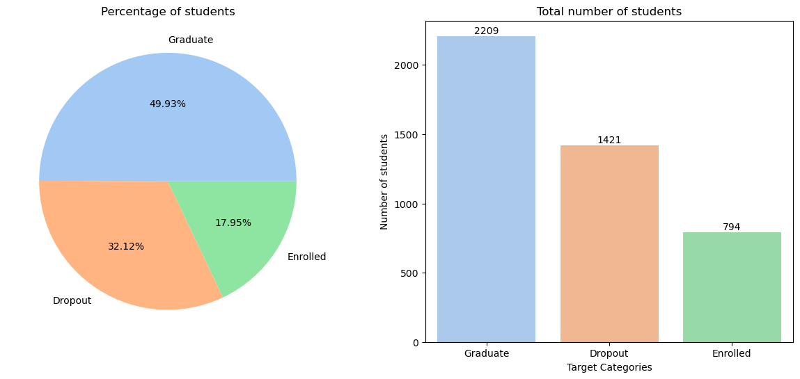
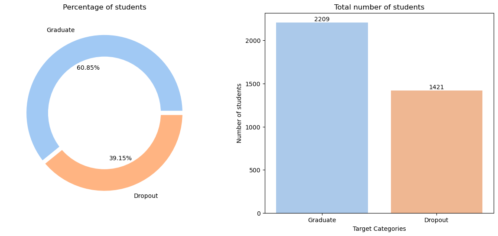
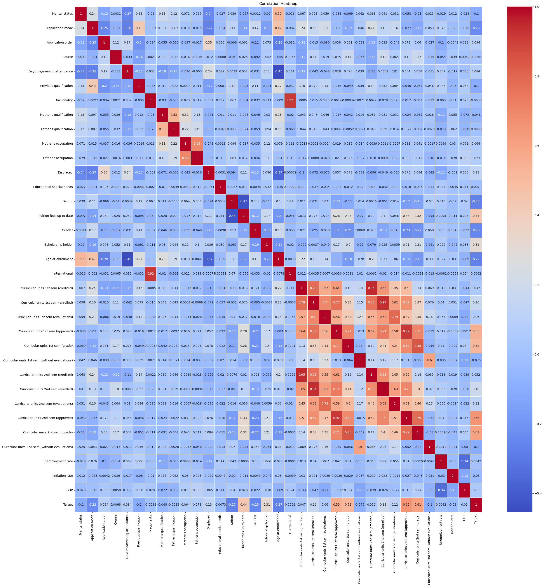
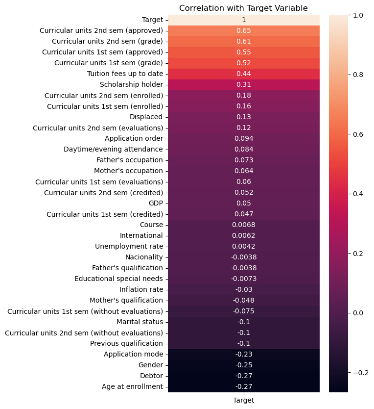
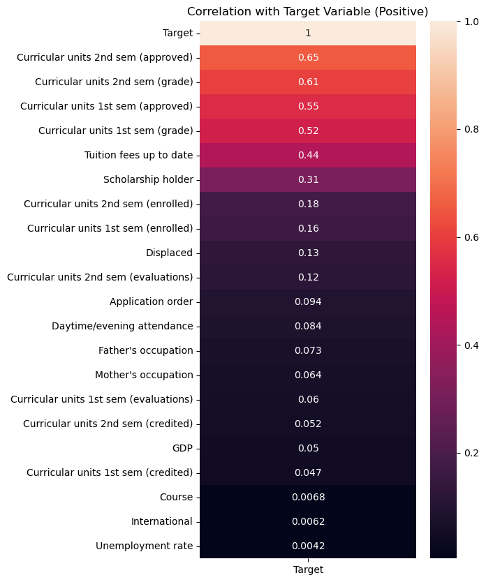
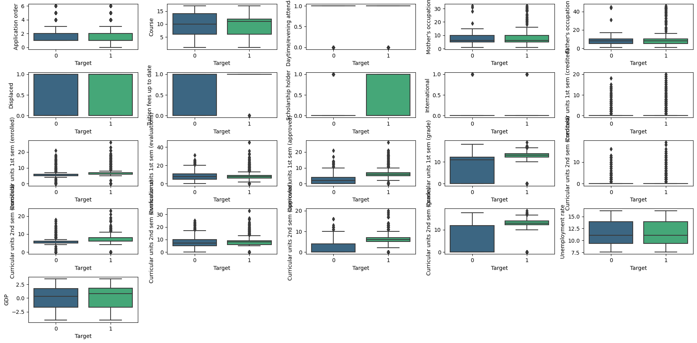
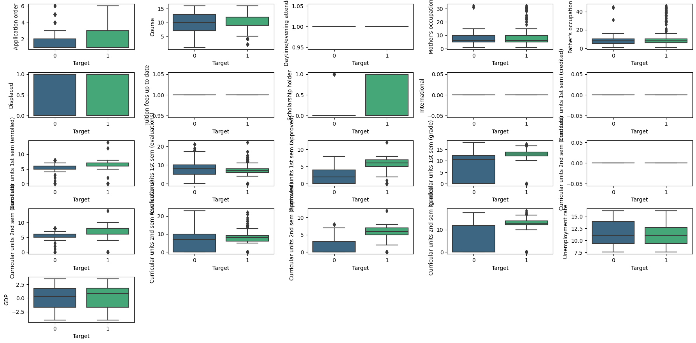
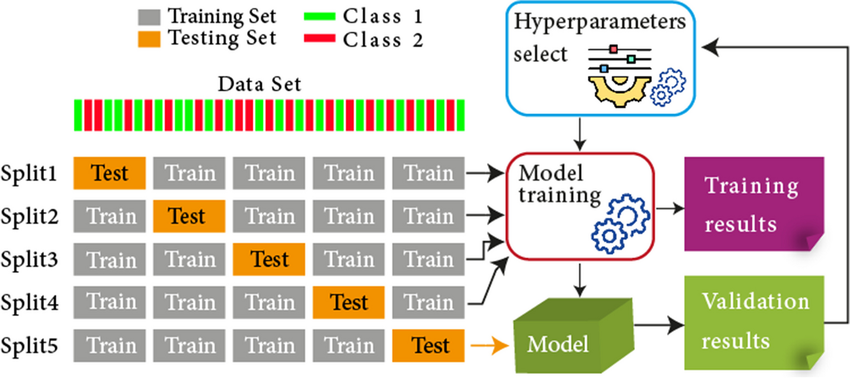
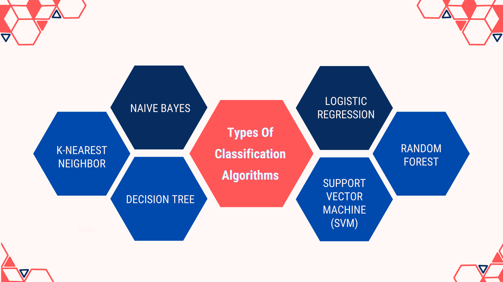

  <h3 align="center">Predict Students Dropout and Academic Success Using Machine Learning Algorithms<h3>

  

    <a href="https://github.com/hamzaezzine/Predict-students-dropout-and-academic-success-using-machine-learning-algorithms/issues">Report Bug</a>
    .
    <a href="https://github.com/hamzaezzine/Predict-students-dropout-and-academic-success-using-machine-learning-algorithms/issues">Request Feature</a>
  

    

## Table Of Contents

- [Table Of Contents](#table-of-contents)
- [Introduction](#introduction)
- [Dataset](#dataset)
- [Data Preprocessing](#data-preprocessing)
- [Models Training](#models-training)
- [Models Results](#models-results)
- [Conclusion](#conclusion)

## Introduction

Higher education plays a crucial role in academic success, social equity, and economic growth. However, the most concerning issue that higher education institutions must address is student dropout.  

Many students abandon their higher education studies before completion, with rates varying significantly among countries. Key factors contributing to dropout are related to socio-economic conditions. To anticipate these dropouts, we will train intelligent models to predict student performance.  

The analysis aims to provide insights into the following key aspects:

**Demographic Analysis**: We will explore how demographic factors such as gender, age at enrollment, marital status, and nationality correlate with student dropout rates.

**Economic Factors**: Investigate the influence of economic factors, such as parental occupation, tuition fee payment status, and scholarship eligibility, on student dropout rates.

**Academic Performance**: Analyze how students' academic performance, represented by variables like curricular units and evaluations, impacts their likelihood of dropping out.

**Social and Special Needs**: Explore whether students with educational special needs or those facing unique challenges like displacement or debt are more susceptible to dropout.

**Macro-economic Factors**: Investigate how broader economic indicators like unemployment rate, inflation rate, and GDP growth relate to dropout rates, as these can indirectly affect education outcomes.

## Dataset

The dataset compiles demographic, socio-economic, macroeconomic information recorded during enrollment, and at semesters 1 and 2, for 4424 students registered between 2008 and 2019 in 17 fields such as agronomy, design, education, etc. There are no missing data, and the CSV file is encoded with 35 attributes categorized into 5 groups: demographic, socio-economic, macroeconomic, and academic (enrollment/semesters).

Features Information:

- **Marital status** : The marital status of the student. (Categorical)

- **Application mode** : The method of application used by the student. (Categorical)

- **Application order** : The order in which the student applied. (Numerical)

- **Course** : The course taken by the student. (Categorical)

- **Daytime/evening attendance** : Whether the student attends classes during the day or in the evening. (Categorical)

- **Previous qualification** : The qualification obtained by the student before enrolling in higher education. (Categorical)

- **Nacionality** : The nationality of the student. (Categorical)

- **Mother's qualification** : The qualification of the student's mother. (Categorical)

- **Father's qualification** : The qualification of the student's father. (Categorical)

- **Mother's occupation** : The occupation of the student's mother. (Categorical)

- **Father's occupation** : The occupation of the student's father. (Categorical)

- **Displaced** : Whether the student is a displaced person. (Categorical)

- **Educational special needs** : Whether the student has any special educational needs. (Categorical)

- **Debtor** : Whether the student is a debtor. (Categorical)

- **Tuition fees up to date** : Whether the student's tuition fees are up to date. (Categorical)

- **Gender** : The gender of the student. (Categorical)

- **Scholarship holder** : Whether the student is a scholarship holder. (Categorical)

- **Age at enrollment** : The age of the student at the time of enrollment. (Numerical)

- **International** : Whether the student is an international student. (Categorical)

- **Curricular units 1st sem (credited)** : The number of curricular units credited by the student in the first semester. (Numerical)

- **Curricular units 1st sem (enrolled)** : The number of curricular units enrolled by the student in the first semester. (Numerical)

- **Curricular units 1st sem (evaluations)** : The number of curricular units evaluated by the student in the first semester. (Numerical)

- **Curricular units 1st sem (approved)** : The number of curricular units approved by the student in the first semester. (Numerical)

## Data Preprocessing

**1. Selection of important classes**

The number of graduating students is higher than the number of dropouts. The total number of graduating and dropout students is 2,209 + 1,421 = 3,630, which is the number of observations to build the models.  

Therefore, remove all rows from the "Enrolled" class:

**2. Select important features**     

A correlation heatmap is a visual representation of the correlation between two or more variables. It is displayed in the form of a grid, where each cell represents the correlation between two variables. Colors in the heatmap are typically used to indicate the strength of the correlation, ranging from red (strong positive correlation) to blue (strong negative correlation).  

The relation of all features to themselves:  
  

The correlation with all features with the target:
  

then we delete all features that have a negative correlation with target : 
  

**3. Removing outliers**  
  Removing outliers is an important step in the data preprocessing process. Outliers, also called outliers or anomalies, are observations that differ significantly from the rest of the data and can distort statistical analyses. The presence of outliers can negatively impact the accuracy of predictive models and the validity of conclusions drawn from the data.  

  IQR (Interquartile Range) is a measure of statistical dispersion that assesses the variability of data. It is calculated as the difference between the third quartile (Q3) and the first quartile (Q1). IQR is a robust measure that is not sensitive to outliers, making it a useful metric for detecting outliers.

  The process of removing outliers using IQR typically involves the following steps:

  1. Calculation of the IQR:
    IQR=Q3−Q1
  2. Setting thresholds: Set thresholds to detect outliers. Values outside of these thresholds can be considered outliers.

  3. Identification of outliers: Identify observations whose values fall outside defined thresholds. A value is considered an outlier if it is less than Q1−k×IQR or greater than Q3+k×IQR, where k is an adjustable factor determining the sensitivity of detection.

  4. Removal of outliers: Delete or treat observations identified as outliers depending on the chosen method

Here is a diagram that displays the boxplots of the important attributes:  
  

The boxplots of important attributes after removing outliers look like this:  
  

## Models Training 

1. Split Dataset :  
  We split the dataset into two parties : **67%** for training and **33%** for testing

2. Data standardization :  
  We standardized the dataset using StandardScaler.

3. Grid Search :  
  The traditional way of performing hyperparameter optimization has been grid search, or a parameter sweep, which is simply an exhaustive searching through a manually specified subset of the hyperparameter space of a learning algorithm. A grid search algorithm must be guided by some performance metric, typically measured by cross-validation on the training set or evaluation on a hold-out validation set.   
    

4. Models Training :  
  We gonna use 6 popular classification algorithms to find the best solution for our problem :  
  

  **4.1. KNN :**  
    K-Nearest Neighbors (KNN) is a simple and intuitive machine learning algorithm used for classification and regression tasks. It assigns a new data point to the majority class of its k nearest neighbors in the feature space, where k is a user-defined parameter.  
  
  **4.2. Logistic Regression :**  
    Logistic Regression is a statistical method used for binary classification problems in machine learning. Despite its name, it's primarily employed for classification tasks. It models the probability that a given instance belongs to a particular category and makes predictions using a logistic function.

  **4.3. Decision Tree :**  
    Decision Tree is a versatile machine learning algorithm used for both classification and regression tasks. It recursively splits the dataset based on the features, creating a tree-like structure where each internal node represents a decision based on a feature, and each leaf node represents the outcome. It's known for its interpretability and ability to handle both numerical and categorical data.

  
  **4.4. Random Forest :**  
    Random Forest is an ensemble learning algorithm that combines multiple decision trees to improve predictive accuracy and control overfitting. It builds a "forest" of trees by training each tree on a random subset of the data and features. The final prediction is often an average or voting mechanism of the individual tree predictions, providing a robust and accurate model for classification and regression tasks.
  
  **4.5. SVM :**  
    Support Vector Machine (SVM) is a powerful supervised machine learning algorithm used for classification and regression tasks. It works by finding the optimal hyperplane that separates different classes in the feature space while maximizing the margin between them. SVM is effective in high-dimensional spaces and is capable of handling both linear and non-linear relationships through the use of kernel functions. It is widely used for its versatility and ability to handle complex decision boundaries.
 
  
  **4.6. Naive Bayes :**  
    Naive Bayes is a probabilistic machine learning algorithm commonly used for classification tasks. It is based on Bayes' theorem and assumes that features are conditionally independent given the class label. Despite its simplifying assumption (naivety), Naive Bayes often performs well in practice, particularly with text classification tasks. It calculates the probability of each class given a set of features and assigns the class with the highest probability to the input data. Naive Bayes is efficient and works well with high-dimensional data.

## Models Results

The result of the 6 algorithmes is : 

1. The SVM model has the best performance in terms of accuracy, precision, recall and F1-score.  
2. Random Forest and Logistic Regression also have high performance.  
3. Naive Bayes, K-Nearest Neighbors and Decision Tree have lower performance compared to other models.  

Taking all measures into account, SVM, Random Forest or Logistic Regression models all appear to be adequate models of the problem of predicting dropout, thus allowing higher education institutions to implement targeted interventions to improve retention. students.

## Conclusion

The choice of the machine learning algorithm depends closely on the nature and specific requirements of the task at hand. There is no universal "best" algorithm, as each algorithm has its own strengths and weaknesses. It is crucial to consider various factors such as the size and complexity of the data, the nature of the task, the availability of training data, and time and resource constraints.

In conclusion, advancements in data analysis and machine learning provide valuable opportunities to enhance the management of educational institutions and support student success.